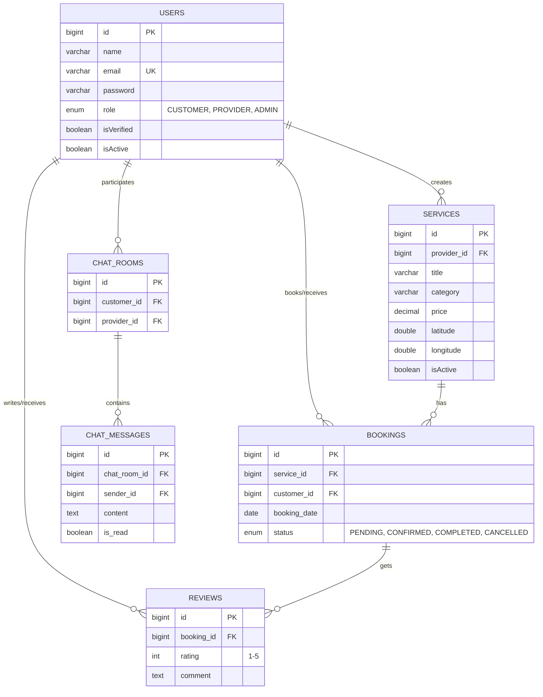
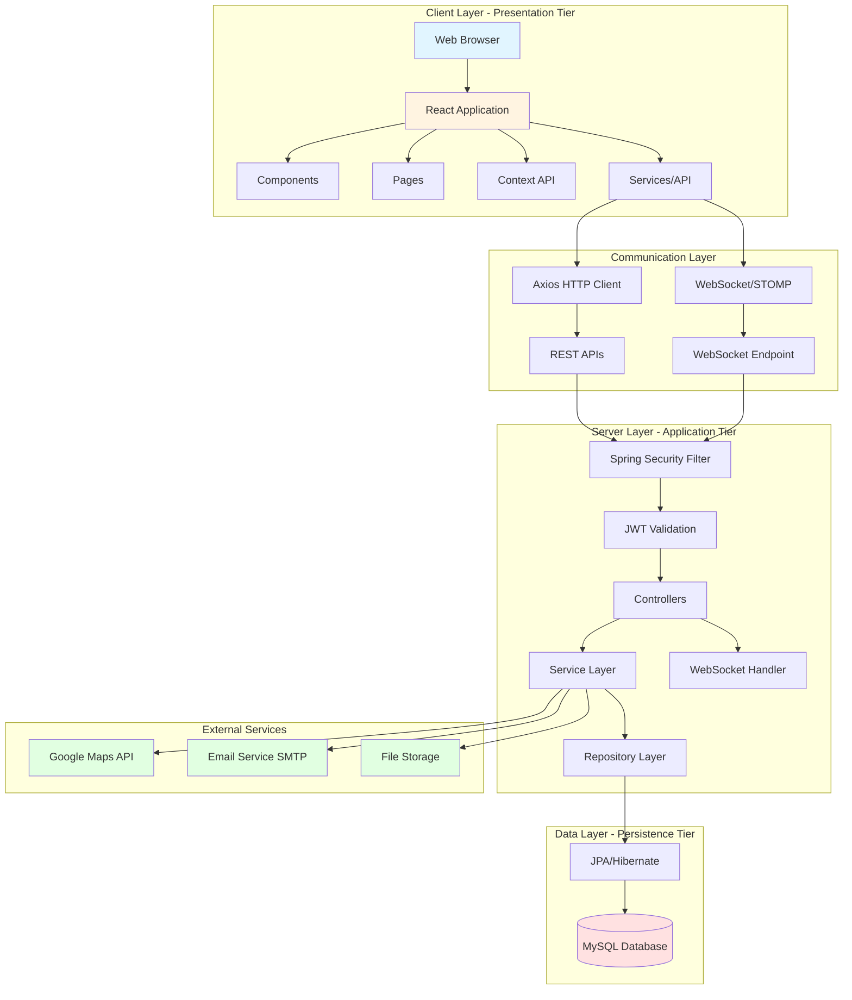
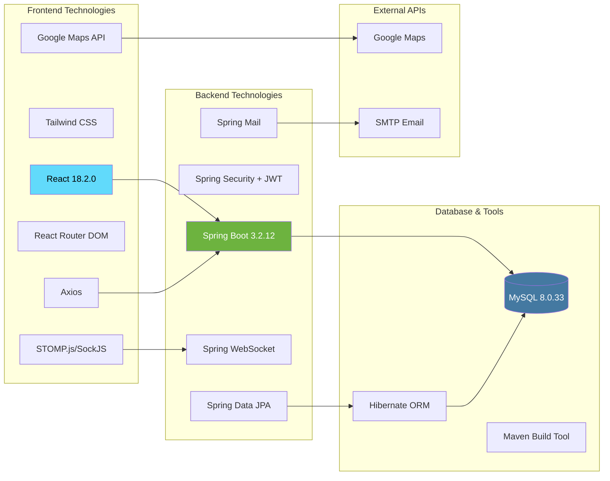

# FixItNow - Essential Mermaid Diagrams for PPT

---

## 1. DATABASE ER DIAGRAM



---

## 2. SYSTEM ARCHITECTURE



---

## 3. COMPLETE SYSTEM FLOW DIAGRAM

```mermaid
graph TB
    subgraph "USER LAYER"
        U1[Customer] 
        U2[Provider]
        U3[Admin]
    end
    
    subgraph "PRESENTATION LAYER - React Frontend"
        P1[Login/Register Pages]
        P2[Service Browsing<br/>List & Map View]
        P3[Booking Management]
        P4[Chat Interface]
        P5[Review System]
        P6[Admin Dashboard]
    end
    
    subgraph "API LAYER - REST & WebSocket"
        A1[Authentication<br/>POST /auth/signin]
        A2[Service APIs<br/>GET/POST /services]
        A3[Booking APIs<br/>GET/POST/PUT /bookings]
        A4[WebSocket /ws<br/>STOMP Protocol]
        A5[Review APIs<br/>GET/POST /reviews]
        A6[Admin APIs<br/>GET/PUT/DELETE]
    end
    
    subgraph "SECURITY LAYER"
        S1[JWT Filter]
        S2[Token Validation]
        S3[Role-Based Access<br/>CUSTOMER/PROVIDER/ADMIN]
    end
    
    subgraph "BUSINESS LOGIC LAYER - Spring Services"
        B1[UserService<br/>Registration & Auth]
        B2[ServiceService<br/>CRUD Operations]
        B3[BookingService<br/>Booking Management]
        B4[ChatService<br/>Real-time Messaging]
        B5[ReviewService<br/>Rating & Feedback]
        B6[AdminService<br/>Verification & Reports]
    end
    
    subgraph "DATA ACCESS LAYER - JPA Repositories"
        D1[UserRepository]
        D2[ServiceRepository]
        D3[BookingRepository]
        D4[ChatRepository]
        D5[ReviewRepository]
    end
    
    subgraph "DATABASE LAYER"
        DB[(MySQL Database<br/>Users | Services | Bookings<br/>Reviews | Chat | Disputes)]
    end
    
    subgraph "EXTERNAL SERVICES"
        E1[Google Maps API<br/>Location Services]
        E2[Email Service<br/>SMTP Notifications]
        E3[File Storage<br/>Images & Documents]
    end
    
    U1 --> P1
    U1 --> P2
    U1 --> P3
    U1 --> P4
    U1 --> P5
    
    U2 --> P1
    U2 --> P2
    U2 --> P3
    U2 --> P4
    
    U3 --> P6
    
    P1 --> A1
    P2 --> A2
    P3 --> A3
    P4 --> A4
    P5 --> A5
    P6 --> A6
    
    A1 --> S1
    A2 --> S1
    A3 --> S1
    A4 --> S1
    A5 --> S1
    A6 --> S1
    
    S1 --> S2
    S2 --> S3
    
    S3 --> B1
    S3 --> B2
    S3 --> B3
    S3 --> B4
    S3 --> B5
    S3 --> B6
    
    B1 --> D1
    B2 --> D2
    B3 --> D3
    B4 --> D4
    B5 --> D5
    B6 --> D1
    B6 --> D2
    
    D1 --> DB
    D2 --> DB
    D3 --> DB
    D4 --> DB
    D5 --> DB
    
    B2 --> E1
    B1 --> E2
    B6 --> E2
    B2 --> E3
    B1 --> E3
    
    style U1 fill:#4caf50,color:#fff
    style U2 fill:#ff9800,color:#fff
    style U3 fill:#9c27b0,color:#fff
    style S1 fill:#f44336,color:#fff
    style DB fill:#2196f3,color:#fff
    style E1 fill:#00bcd4,color:#fff
    style E2 fill:#00bcd4,color:#fff
    style E3 fill:#00bcd4,color:#fff
```

---

## 4. TECHNOLOGY STACK DIAGRAM



---

## HOW TO USE THESE DIAGRAMS

### Quick Steps:
1. **Copy Mermaid code** from any diagram above
2. **Paste into** https://mermaid.live/
3. **Export as PNG/SVG** for your presentation
4. **Insert into PowerPoint slides**

### Color Code Legend:
- 🟢 Green: Customer/Success
- 🟠 Orange: Provider/Warning  
- 🟣 Purple: Admin/Special
- 🔵 Blue: Database/Primary
- 🔴 Red: Security/Error
- 🔷 Cyan: External Services

---

**Essential Diagrams for Presentation:**
1. **Database ER Diagram** - Shows data structure
2. **System Architecture** - Three-tier architecture  
3. **Complete System Flow** - End-to-end workflow
4. **Technology Stack** - All technologies used

*Use mermaid.live to render and export these diagrams for your PPT!*
